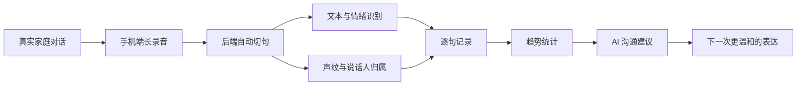
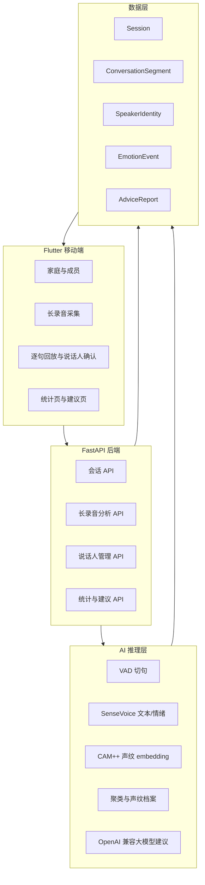
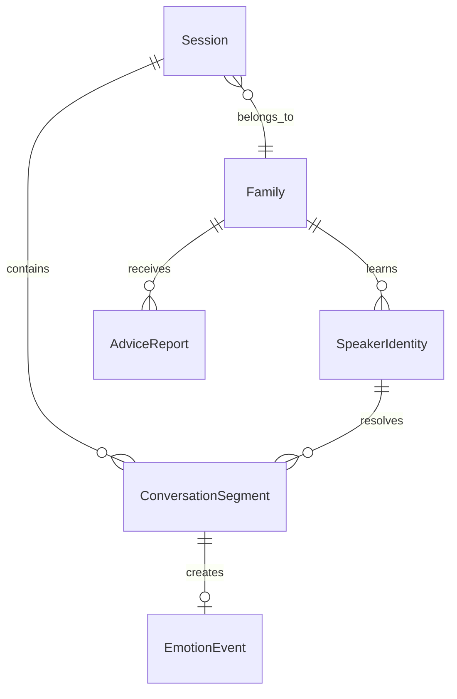
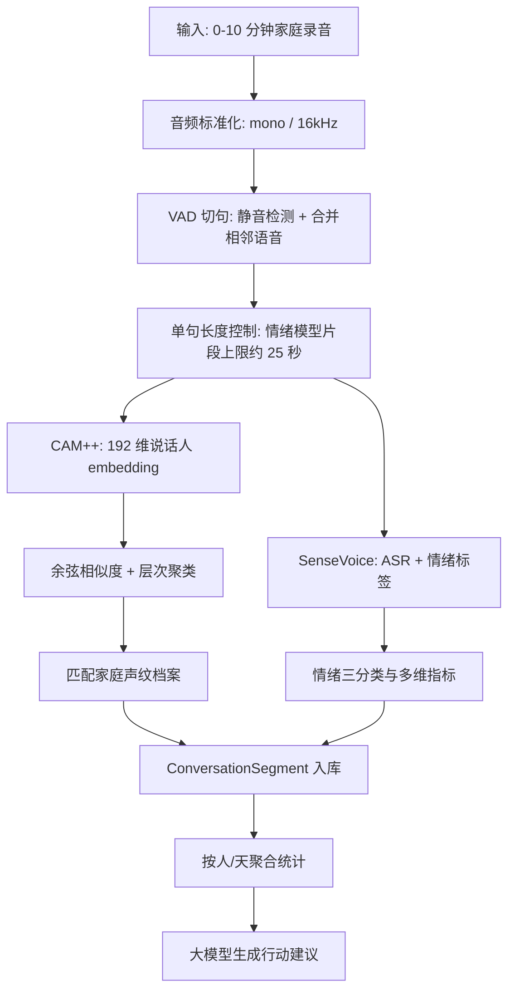
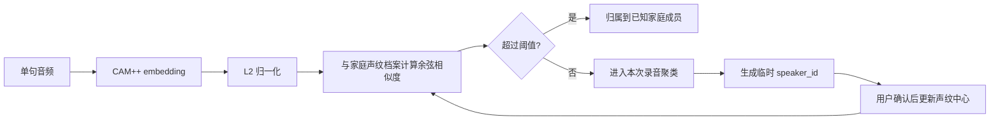

# SofterPlease: 让家庭沟通被温柔地看见

> 一次录音，拆成可回放的句子；一段对话，沉淀成可行动的建议。  
> SofterPlease 想做的不是评判谁对谁错，而是帮助家庭把真实沟通看清楚。

## 01. 为什么做这个产品

很多家庭冲突并不是从“大问题”开始的。

它可能只是下班后的一句“快点写作业”，也可能是孩子顶嘴后的几秒沉默。真正让人难受的，往往不是某一句话本身，而是我们在情绪上来时没有意识到：语气已经变硬，节奏已经变快，对话已经从沟通变成了对抗。

SofterPlease 的设计理念很简单：

**不要让 AI 站在家人中间做裁判，而是让 AI 站在旁边，帮我们复盘和修正。**

它面向的不是医疗诊断，也不是心理标签，而是日常家庭沟通中的三个具体问题：

1. 当时发生了什么：谁在什么时间说了什么。
2. 情绪如何变化：哪些片段开始紧张，哪些片段是正向回应。
3. 下一次怎么做得更好：给出温和、具体、可执行的沟通建议。

这就是 SofterPlease 的产品核心：**把一次容易被情绪淹没的对话，变成可以被理解、回放、修正和成长的数据。**

## 02. 产品体验: 从录音到建议

用户侧的使用路径被刻意设计得很轻：

1. 创建家庭，进入录音页。
2. 按下长录音按钮，记录真实对话。
3. 后端自动切句、识别文本、判断情绪、区分说话人。
4. 用户可以逐句回放，也可以修正说话人。
5. 统计页展示每个角色的趋势。
6. 大模型基于当天数据生成家庭沟通建议。

这里最重要的产品取舍是：**不要求用户在录音前做复杂标注，也不要求用户在录音后手动整理。**

家庭沟通本来就发生在真实生活里。产品如果需要用户每句话都手动上传、剪辑、分类，那就失去了被长期使用的可能。SofterPlease 的技术架构围绕这一点展开：长录音自动处理、逐句可追溯、识别结果可纠正、系统持续学习。

## 03. 系统架构: 轻客户端 + 可解释 AI 后端

SofterPlease 采用 Flutter 移动端 + FastAPI 后端的结构。移动端负责录音、展示、回放、用户确认；后端负责音频处理、模型推理、说话人管理、统计聚合和大模型建议生成。

这套架构有三个特点：

**第一，原始交互尽量简单。**  
手机端只需要完成录音和展示，把复杂的音频切分、模型加载、说话人归属都放到后端。

**第二，每个识别结果都可追溯。**  
系统不是只给一个“今天情绪不好”的结论，而是保存每句话的起止时间、音频片段、识别文本、情绪值、模型后端、置信度、说话人归属和人工修正状态。

**第三，大模型只做建议，不做事实判断。**  
事实层来自结构化数据和逐句记录，大模型负责把这些事实组织成更容易执行的沟通建议，避免把“生成能力”误用成“诊断能力”。

## 04. 核心数据模型: 一句话就是一个最小证据单元

SofterPlease 的关键不是“录了一整段音频”，而是把长音频拆成一个个可验证的句子。

核心数据对象可以理解为：

| 数据对象 | 作用 |
| --- | --- |
| `Session` | 一次连续沟通记录，保存家庭、设备、开始结束时间和整体统计 |
| `ConversationSegment` | VAD 切出来的一句话，保存文本、情绪、声纹、说话人和音频路径 |
| `SpeakerIdentity` | 家庭内的说话人档案，保存显示名、声纹中心向量和样本数量 |
| `EmotionEvent` | 情绪事件，用于统计、趋势和反馈 |
| `AdviceReport` | 大模型生成的建议报告，保存当时的数据快照和建议内容 |

这种设计让产品天然具备“复盘能力”：

- 用户可以回到某一句，听原音频。
- 用户可以看到这句话为什么被判为正向、中性或负向。
- 用户可以修正说话人，让系统下次更准。
- 建议报告可以引用当天真实片段，而不是泛泛而谈。

## 05. 算法链路: 从长录音到家庭建议

SofterPlease 的算法实现可以拆成五层。

### 5.1 VAD: 先把长录音切成可理解的句子

家庭真实录音最大的问题是：它不是干净的单句语音，而是有停顿、有噪声、有插话、有沉默的长音频。

SofterPlease 使用基于能量的语音活动检测，把音频切成语音片段，并做三件事：

1. 对短停顿进行合并，避免一句话被切得过碎。
2. 对片段前后加少量 padding，避免切掉开头和尾音。
3. 控制单段最长时间，避免超过模型适合处理的窗口。

当前后端的设计里：

- 长录音上限约 10 分钟。
- 说话人 diarization 窗口控制在约 8 秒。
- 情绪模型单句片段上限约 25 秒。

这是一种务实的工程取舍：宁可把一次长录音拆成可复核的小片段，也不要让模型对一整段混乱音频给一个不可解释的总分。

### 5.2 SenseVoice: 同时拿到文本和情绪线索

在每个语音片段上，SofterPlease 默认使用 SenseVoiceSmall 作为文本与情绪识别后端。

SenseVoice 的价值在于它不仅能输出转写文本，还能返回类似 `HAPPY`、`SAD`、`ANGRY`、`NEUTRAL` 的情绪标签。系统会把这些标签映射成更适合产品使用的三类结果：

| 模型标签 | 产品情绪值 | 产品含义 |
| --- | ---: | --- |
| `HAPPY` | `+1` | 正向、鼓励、肯定 |
| `NEUTRAL` | `0` | 中性、信息表达 |
| `SAD` / `ANGRY` | `-1` | 负向、紧张、压力或冲突 |

同时，系统还保留了更细的多维指标：

- `valence`: 情感效价，偏正向还是负向。
- `arousal`: 唤醒度，语气是否激动。
- `stress`: 压力指数。
- `impatience`: 不耐烦指数。
- `confidence`: 模型置信度。

产品上看起来只是“中性 / 正向 / 负向”，但底层保留多维信息，是为了后续做更细的趋势判断和个性化建议。

### 5.3 CAM++: 让“谁说的”变得可学习

家庭对话分析不能只知道“有人说了什么”，还要知道“是谁说的”。

SofterPlease 使用 CAM++ 提取说话人声纹 embedding。每个语音片段会得到一个向量，系统再做两层处理：

1. **本次录音内聚类**  
   使用余弦距离和层次聚类，把同一段录音里相似的声音聚到一起，形成 `speaker_1`、`speaker_2` 这类临时说话人。

2. **匹配家庭声纹档案**  
   如果用户曾经确认过“这句话是爸爸/妈妈/孩子说的”，系统会把该片段的 embedding 融入家庭声纹档案。后续新录音会先与已知档案做相似度匹配，达到阈值后自动归属。

这一步让 SofterPlease 具备“越用越贴近家庭”的能力。它不是一次性要求用户完成声纹注册，而是在真实使用中逐步学习。

### 5.4 人工确认: 让 AI 有机会变好

很多 AI 产品的问题是：模型错了，用户只能忍。

SofterPlease 选择了另一条路：**允许模型犯错，但必须让用户能修正。**

每个 `ConversationSegment` 都有：

- 预测说话人。
- 置信度。
- 是否人工确认。
- 修正后的说话人。
- 归属来源。

当用户确认某一句的说话人后，系统会更新对应家庭成员的声纹中心向量。更新方式不是简单覆盖，而是把新样本和旧中心做加权融合，让声纹档案逐步稳定。

这也是产品信任感的来源：用户不是被 AI 管理，而是在训练一个只属于自己家庭的沟通助手。

### 5.5 大模型建议: 只基于事实，不制造诊断

当一天的数据被聚合后，SofterPlease 会构造结构化快照：

- 每个说话人的发言数量。
- 正向、中性、负向分布。
- 当天代表性对话片段。
- 最近趋势。
- 用户确认过的说话人名称。

然后通过 OpenAI 兼容接口请求大模型生成建议。提示词约束非常明确：

- 必须区分事实和推测。
- 不做医学或心理疾病诊断。
- 必须给每个 `speaker_id` 分别输出建议。
- 建议要可执行，而不是空泛鸡汤。

所以产品最后呈现的不是“你们家关系不好”，而是类似：

- 今天爸爸多次催促作业，语气偏急；可以先确认孩子卡在哪里，再给出一个明确的下一步。
- 妈妈有几次正向反馈，建议保留这种具体表扬。
- 孩子的回应偏短，可能需要更多选择题式提问，而不是连续追问。

这就是 SofterPlease 的边界：**AI 不替家庭下结论，只帮助家庭看到事实，并给出下一次可以尝试的表达。**

## 06. 工程实现: 为什么它不是一个简单 Demo

一个真正可用的家庭沟通助手，难点不在“调用一个模型”，而在一整条链路能不能闭环。

SofterPlease 的工程闭环包括：

| 环节 | 工程挑战 | SofterPlease 的处理 |
| --- | --- | --- |
| 长录音 | 音频长、静音多、噪声多 | VAD 切句，合并短停顿，控制单段长度 |
| 情绪识别 | 日常对话大多不是强情绪 | 模型标签 + 声学特征 + 可选校准器 |
| 说话人识别 | 家庭成员声音相近，样本少 | CAM++ embedding + 聚类 + 用户确认学习 |
| 可解释性 | 不能只给一个分数 | 保存逐句音频、文本、时间、模型结果 |
| 建议生成 | 大模型容易泛化和编造 | 结构化快照 + 事实/推测边界 + 不诊断约束 |
| 隐私信任 | 家庭语音高度敏感 | API key 不在服务端持久化，建议基于用户临时配置调用 |

特别是“逐句保存”这个设计，看起来增加了数据量，却换来了三个关键能力：

1. 用户可以检查模型有没有错。
2. 用户可以训练系统认识家庭成员。
3. 后续建议有真实证据支撑。

对于家庭沟通这种敏感场景，可信度比炫技更重要。

## 07. 可扩展方向

SofterPlease 当前已经跑通了从录音到建议的核心链路。后续可以继续扩展几个方向：

### 方向一: 更细的家庭沟通事件识别

不只识别单句情绪，还可以识别对话结构：

- 打断。
- 反复催促。
- 正向回应。
- 命令式表达。
- 具体表扬。
- 沉默后的重新连接。

这样建议会更像“沟通教练”，而不只是“情绪统计”。

### 方向二: 个性化校准

每个家庭的说话风格不同。有些人天生语速快，有些人音量大，有些家庭表达本来就直接。

因此 SofterPlease 的长期方向不是做一个放之四海皆准的情绪模型，而是做“家庭内校准”：

- 以家庭自己的历史数据作为基线。
- 以用户确认作为反馈信号。
- 区分“这个人平时就这样说话”和“今天明显更紧张”。

### 方向三: 隐私优先的本地化推理

家庭语音是非常敏感的数据。未来可以进一步把更多推理放到端侧或家庭本地服务器：

- 端侧 VAD。
- 端侧声纹归属。
- 本地情绪校准器。
- 云端只接收结构化摘要。

这会让产品更适合长期陪伴型场景。

## 08. 一句话总结

SofterPlease 不是想让 AI 变成家庭里的裁判。

它更像一面温和的镜子：  
把一次真实对话拆开，标出时间、角色、情绪和趋势，再用尽量克制的方式提醒我们：

**下一次，也许可以说得更温柔一点。**

如果你也相信技术不只应该提高效率，也可以帮助人和人更好地相处，欢迎关注 SofterPlease。  
也欢迎提出宝贵建议，一起把家庭沟通这件小事，做得更认真、更温柔。

## 附: 适合传播的短标题

1. 我做了一个 AI 家庭沟通助手，让每次争吵都有机会被复盘
2. 不做裁判，只做镜子: 一个家庭语音 AI 助手的设计与实现
3. 从长录音到沟通建议: SofterPlease 的产品架构和算法方案
4. AI 能不能让家人好好说话？我做了一个真实产品实验
5. 用 SenseVoice + CAM++ 做一个家庭沟通助手

